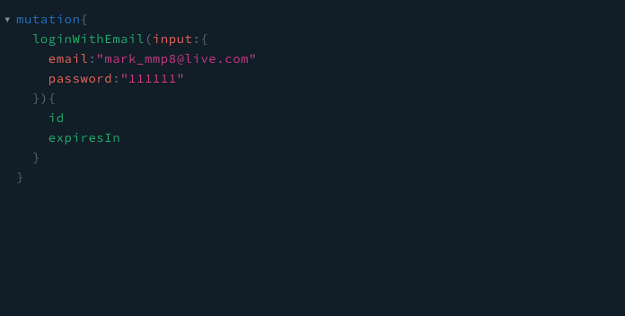
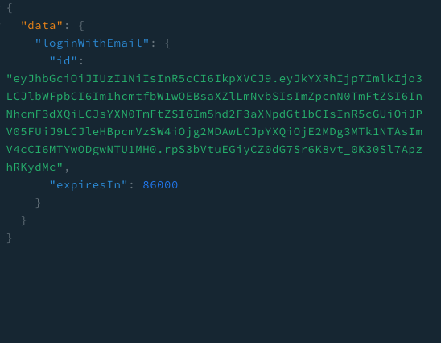
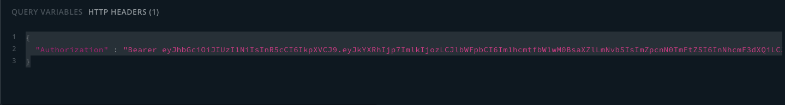

# Design System Diagram

---

[https://bit.ly/3aEvms9](https://bit.ly/3aEvms9)

# Design Database Diagram

---

[https://dbdiagram.io/d/5fe55a029a6c525a03bc4134](https://dbdiagram.io/d/5fe55a029a6c525a03bc4134)

# Project Requirement

---

- yarn
- docker
- sequelize

# Installation

---

yarn # install **dependenciesse**

docker-compose up  # start project

## End Point Url

---

[http://localhost:3000/graphql](http://localhost:3000/graphql)

# Overview API

---

### how to login

mutation loginWithEmail

get token

## get token from data.loginWithEmail.id

add header "Authorization" : "Bearer {{token}}" 

### assignment

- สร้าง account เจ้าของฟาร์มได้
    - mutation registerUserWithEmail
        - type ADMIN (ผู้ดูแลระบบ)
        - type OWNER (เจ้าของฟาร์ม)
        - type WORKER (คนงานในฟาร์ม)
- เจ้าของฟาร์มต้อง login ก่อนใช้งาน
    - mutation loginWithEmail
- เพิ่ม/ลบ/แก้ไขคนงานในฟาร์มได้ (permission for OWNER)
    - mutation registerWorker
    - mutation updateWorker
    - mutation destroyWorker
- สร้างฟาร์มได้ (permission for OWNER)
    - mutation registerFarm
    - mutation updateFarm
- เพิ่ม/ลบ/แก้ไขรถไถในฟาร์มได้ (permission for OWNER)
    - mutation registerTractor
    - mutation registerTractor
    - mutation registerTractor
- เพิ่ม/ลบ/แก้ไขแปลงในฟาร์มได้ (permission for OWNER)
    - mutation registerGarden
    - mutation registerGarden
    - mutation registerGarden
- เพิ่มกิจกรรมในแปลงได้ (permission for WORKER)
    - mutation registerEvent
    - mutation registerEvent
    - mutation registerEvent
- สรุปรายรับ รายจ่ายในแต่ละช่วงเวลาได้ (permission for OWNER)
    - query summary
